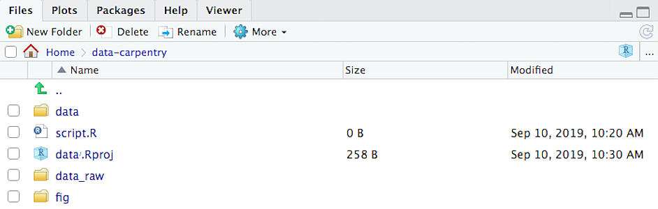

# Welcome

Dear Students,

Welcome to Programming in R! My name is Amanda Suzzi and I'll be lead
you on this adventure. I am excited to have you in my class this
semester and look forward to embarking on a journey together as we learn
data manipulation, data visualization, creating dynamic document, and
developing shiny web applications.

Hands-on computer exercises based on a wide range of materials are
utilized to provide a solid foundation for further R programming
classes.

# Preparations

My teaching is hands-on, and to follow these lessons, you must have R
and RStudio installed on their computers. You also need to be able to
install a number of R packages, create directories, and download files.

To avoid troubleshooting during the lessons, You should follow the
instruction below to download and install (or update) everything
beforehand.

## Install R and RStudio

R and RStudio are two separate pieces of software:

-   **R** is a programming language that is especially powerful for data
    exploration, visualization, and statistical analysis
-   **RStudio** is an integrated development environment (IDE) that
    makes using R easier. In this course we use RStudio to interact
    with R.

If you don't already have R and RStudio installed, follow the
instructions for your operating system below. You have to install R
before you install RStudio.

### Windows

-   Download R from the [CRAN
    website](https://cran.r-project.org/bin/windows/base/release.htm).
-   Run the `.exe` file that was just downloaded
-   Go to the [RStudio download
    page](https://www.rstudio.com/products/rstudio/download/#download)
-   Under *Installers* select **RStudio x.yy.zzz - Windows
    Vista/7/8/10** (where x, y, and z represent version numbers)
-   Double click the file to install it
-   Once it's installed, open RStudio to make sure it works and you
    don't get any error messages.

### MacOS

-   Download R from the [CRAN
    website](https://cran.r-project.org/bin/macosx/).
-   Select the `.pkg` file for the latest R version
-   Double click on the downloaded file to install R
-   It is also a good idea to install
    [XQuartz](https://www.xquartz.org/) (needed by some packages)
-   Go to the [RStudio download
    page](https://www.rstudio.com/products/rstudio/download/#download)
-   Under *Installers* select **RStudio x.yy.zzz - Mac OS X 10.6+
    (64-bit)** (where x, y, and z represent version numbers)
-   Double click the file to install RStudio
-   Once it's installed, open RStudio to make sure it works and you
    don't get any error messages.

### Linux

-   Follow the instructions for your distribution from
    [CRAN](https://cloud.r-project.org/bin/linux), they provide
    information to get the most recent version of R for common
    distributions. For most distributions, you could use your package
    manager (e.g., for Debian/Ubuntu run `sudo apt-get install r-base`,
    and for Fedora `sudo yum install R`), but we don't recommend this
    approach as the versions provided by this are usually out of date.
    In any case, make sure you have at least R 3.3.1.
-   Go to the [RStudio download
    page](https://www.rstudio.com/products/rstudio/download/#download)
-   Under *Installers* select the version that matches your
    distribution, and install it with your preferred method (e.g., with
    Debian/Ubuntu `sudo dpkg -i   rstudio-x.yy.zzz-amd64.deb` at the
    terminal).
-   Once it's installed, open RStudio to make sure it works and you
    don't get any error messages.

## Update R and RStudio

If you already have R and RStudio installed, check if your R and RStudio
are up to date:

-   When you open RStudio your R version will be printed in the console
    on the bottom left. Alternatively, you can type `sessionInfo()` into
    the console. If your R version is 4.0.0 or later, you don't need to
    update R for this lesson. If your version of R is older than that,
    download and install the latest version of R from the R project
    website [for Windows](https://cran.r-project.org/bin/windows/base/),
    [for MacOS](https://cran.r-project.org/bin/macosx/), or [for
    Linux](https://cran.r-project.org/bin/linux/)
-   To update RStudio to the latest version, open RStudio and click on
    `Help" > Check for updates`. If a new version is available, quit
    RStudio, follow the instruction on screen.

Note: It is not necessary to remove old versions of R from your system,
but if you wish to do so you can [check
here.](https://cran.r-project.org/bin/windows/base/rw-FAQ.html#How-do-I-UNinstall-R_003f)

## Install required R package

During the course we will need a number of R packages. Packages contain
useful R code written by other people. We will use the package
`tidyverse`.

To try to install this package, open RStudio and copy and paste the
following command into the console window (look for a blinking cursor on
the bottom left), then press the Enter (Windows and Linux) or Return
(MacOS) to execute the command.

    install.package("tidyverse")

Alternatively, you can install the packages using RStudio's graphical
user interface by going to `Tools > Install Packages` and typing the
names of the packages separated by a comma.

R tries to download and install the packages on your machine. When the
installation has finished, you can try to load the packages by pasting
the following code into the console:

    library(tidyverse)

If you do not see an error, you are good to go!


# Lesson 1: Background and Getting Started

## What is R? What is RStudio?

The term "`R`" is used to refer to both the programming language and the
software that interprets the scripts written using it.

[RStudio](https://rstudio.com) is currently a very popular way to not only write
your R scripts but also to interact with the R software. To function correctly,
RStudio needs R and therefore both need to be installed on your computer.

## Why learn R?

### R does not involve lots of pointing and clicking, and that's a good thing

The learning curve might be steeper than with other software, but with R, the
results of your analysis do not rely on remembering a succession of pointing and
clicking, but instead on a series of written commands, and that's a good thing!
So, if you want to redo your analysis because you collected more data, you don't
have to remember which button you clicked in which order to obtain your results;
you just have to run your script again.

Working with scripts makes the steps you used in your analysis clear, and the
code you write can be inspected by someone else who can give you feedback and
spot mistakes.

Working with scripts forces you to have a deeper understanding of what you are
doing, and facilitates your learning and comprehension of the methods you use.

### R code is great for reproducibility

Reproducibility is when someone else (including your future self) can obtain the
same results from the same dataset when using the same analysis.

R integrates with other tools to generate manuscripts from your code. If you
collect more data, or fix a mistake in your dataset, the figures and the
statistical tests in your manuscript are updated automatically.

An increasing number of journals and funding agencies expect analyses to be
reproducible, so knowing R will give you an edge with these requirements.

### R is interdisciplinary and extensible

With 10,000+ packages that can be installed to extend its capabilities, R
provides a framework that allows you to combine statistical approaches from many
scientific disciplines to best suit the analytical framework you need to analyze
your data. For instance, R has packages for image analysis, GIS, time series,
population genetics, and a lot more.

### R works on data of all shapes and sizes

The skills you learn with R scale easily with the size of your dataset. Whether
your dataset has hundreds or millions of lines, it won't make much difference to
you.

R is designed for data analysis. It comes with special data structures and data
types that make handling of missing data and statistical factors convenient.

R can connect to spreadsheets, databases, and many other data formats, on your
computer or on the web.

### R produces high-quality graphics

The plotting functionalities in R are endless, and allow you to adjust any
aspect of your graph to convey most effectively the message from your data.

### R has a large and welcoming community

Thousands of people use R daily. Many of them are willing to help you through
mailing lists and websites such as [Stack Overflow](https://stackoverflow.com/),
or on the [RStudio community](https://community.rstudio.com/).

### Not only is R free, but it is also open-source and cross-platform

Anyone can inspect the source code to see how R works. Because of this
transparency, there is less chance for mistakes, and if you (or someone else)
find some, you can report and fix bugs.

## Knowing your way around RStudio

Let's start by learning about [RStudio](https://www.rstudio.com/), which is an
Integrated Development Environment (IDE) for working with R.

The RStudio IDE open-source product is free under the [Affero General Public
License (AGPL) v3](https://www.gnu.org/licenses/agpl-3.0.en.html). The RStudio
IDE is also available with a commercial license and priority email support from
RStudio, PBC.

We will use RStudio IDE to write code, navigate the files on our computer,
inspect the variables we are going to create, and visualize the plots we will
generate. RStudio can also be used for other things (e.g., version control,
developing packages, writing Shiny apps) that we will not cover during the
class.


RStudio is divided into 4 "Panes": the **Source** for your scripts and documents
(top-left, in the default layout), your **Environment/History** (top-right)
which shows all the objects in your working space (Environment) and your command
history (History), your **Files/Plots/Packages/Help/Viewer** (bottom-right), and
the R **Console** (bottom-left). The placement of these panes and their content
can be customized (see menu, Tools -\> Global Options -\> Pane Layout).

One of the advantages of using RStudio is that all the information you need to
write code is available in a single window. Additionally, with many shortcuts,
autocompletion, and highlighting for the major file types you use while
developing in R, RStudio will make typing easier and less error-prone.

## Getting set up

It is good practice to keep a set of related data, analyses, and text
self-contained in a single folder, called the **working directory**. All of the
scripts within this folder can then use *relative paths* to files that indicate
where inside the project a file is located (as opposed to absolute paths, which
point to where a file is on a specific computer). Working this way makes it a
lot easier to move your project around on your computer and share it with others
without worrying about whether or not the underlying scripts will still work.

RStudio provides a helpful set of tools to do this through its "Projects"
interface, which not only creates a working directory for you, but also
remembers its location (allowing you to quickly navigate to it) and optionally
preserves custom settings and open files to make it easier to resume work after
a break. Go through the steps for creating an "R Project" for this tutorial
below.

1.  Start RStudio.
2.  Under the `File` menu, click on `New Project`. Choose `New Directory`, then
    `New Project`.
3.  Enter a name for this new folder (or "directory"), and choose a convenient
    location for it. This will be your **working directory** for the rest of the
    day (e.g., `~/HONORS391/`).
4.  Click on `Create Project`.
5.  (Optional) Set Preferences to 'Never' save workspace in RStudio.

A workspace is your current working environment in R which includes any
user-defined object. By default, all of these objects will be saved, and
automatically loaded, when you reopen your project. Saving a workspace to
`.RData` can be cumbersome, especially if you are working with larger datasets,
and it can lead to hard to debug errors by having objects in memory you forgot
you had. To turn that off, go to Tools --\> 'Global Options' and select the
'Never' option for 'Save workspace to .RData' on exit.'


### Organizing your working directory

Using a consistent folder structure across your projects will help keep things
organized, and will also make it easy to find/file things in the future. This
can be especially helpful when you have multiple projects. In general, you may
create directories (folders) for **scripts**, **data**, and **documents**.

-   **`data_raw/` & `data/`** Use these folders to store raw data and
    intermediate datasets you may create for the need of a particular analysis.
    For the sake of transparency and
    [provenance](https://en.wikipedia.org/wiki/Provenance), you should *always*
    keep a copy of your raw data accessible and do as much of your data cleanup
    and preprocessing programmatically (i.e., with scripts, rather than
    manually) as possible. Separating raw data from processed data is also a
    good idea. For example, you could have files
    `data_raw/tree_survey.plot1.txt` and `...plot2.txt` kept separate from a
    `data/tree.survey.csv` file generated by the
    `scripts/01.preprocess.tree_survey.R` script.
-   **`documents/`** This would be a place to keep outlines, drafts, and other
    text.
-   **`scripts/`** This would be the location to keep your R scripts for
    different analyses or plotting, and potentially a separate folder for your
    functions (more on that later).
-   **Additional (sub)directories** depending on your project needs.

For this class, we will need a `data_raw/` folder to store our raw data, and
we will use `data/` for when we learn how to export data as CSV files, and a
`fig/` folder for the figures that we will save.

-   Under the `Files` tab on the right of the screen, click on `New Folder` and
    create a folder named `data_raw` within your newly created working directory
    (e.g., `~/HONORS391/`). (Alternatively, type `dir.create("data_raw")`
    at your R console.) Repeat these operations to create a `data` and a `fig`
    folder.

We are going to keep the script in the root of our working directory because we
are only going to use one file and it will make things easier.

Your working directory should now look like this:

```{r, results='markup',fig.cap="How it should look like at the beginning of this lesson", echo=FALSE, purl=FALSE, out.width='100%', fig.align='center'}

```


### The working directory

The working directory is an important concept to understand. It is the place
from where R will be looking for and saving the files. When you write code for
your project, it should refer to files in relation to the root of your working
directory and only need files within this structure.

Using RStudio projects makes this easy and ensures that your working directory
is set properly. If you need to check it, you can use `getwd()`. If for some
reason your working directory is not what it should be, you can change it in the
RStudio interface by navigating in the file browser where your working directory
should be, and clicking on the blue gear icon "More", and select "Set As Working
Directory". Alternatively you can use `setwd("/path/to/working/directory")` to
reset your working directory. However, your scripts should not include this line
because it will fail on someone else's computer. Note the the use of regular slashes, this is a weirdness of R, since it's using simple blackslashes for specific instructions.

## Interacting with R

The basis of programming is that we write down instructions for the computer to
follow, and then we tell the computer to follow those instructions. We write, or
*code*, instructions in R because it is a common language that both the computer
and we can understand. We call the instructions *commands* and we tell the
computer to follow the instructions by *executing* (also called *running*) those
commands.

There are two main ways of interacting with R: by using the console or by using
script files (plain text files that contain your code). The console pane (in
RStudio, the bottom left panel) is the place where commands written in the R
language can be typed and executed immediately by the computer. It is also where
the results will be shown for commands that have been executed. You can type
commands directly into the console and press `Enter` to execute those commands,
but they will be forgotten when you close the session.

Because we want our code and workflow to be reproducible, it is better to type
the commands we want in the script editor, and save the script. This way, there
is a complete record of what we did, and anyone (including our future selves!)
can easily replicate the results on their computer.

RStudio allows you to execute commands directly from the script editor by using
the <kbd>`Ctrl`</kbd> + <kbd>`Enter`</kbd> shortcut (on Macs, <kbd>`Cmd`</kbd> +
<kbd>`Return`</kbd> will work, too). The command on the current line in the
script (indicated by the cursor) or all of the commands in the currently
selected text will be sent to the console and executed when you press
<kbd>`Ctrl`</kbd> + <kbd>`Enter`</kbd>. You can find other keyboard shortcuts in
this [RStudio cheatsheet about the RStudio
IDE](https://github.com/rstudio/cheatsheets/raw/master/rstudio-ide.pdf).

At some point in your analysis you may want to check the content of a variable
or the structure of an object, without necessarily keeping a record of it in
your script. You can type these commands and execute them directly in the
console. RStudio provides the <kbd>`Ctrl`</kbd> + <kbd>`1`</kbd> and
<kbd>`Ctrl`</kbd> + <kbd>`2`</kbd> shortcuts allow you to jump between the
script and the console panes.

If R is ready to accept commands, the R console shows a `>` prompt. If it
receives a command (by typing, copy-pasting or sent from the script editor using
<kbd>`Ctrl`</kbd> + <kbd>`Enter`</kbd>), R will try to execute it, and when
ready, will show the results and come back with a new `>` prompt to wait for new
commands.

If R is still waiting for you to enter more data because it isn't complete yet,
the console will show a `+` prompt. It means that you haven't finished entering
a complete command. This is because you have not 'closed' a parenthesis or
quotation, i.e. you don't have the same number of left-parentheses as
right-parentheses, or the same number of opening and closing quotation marks.
When this happens, and you thought you finished typing your command, click
inside the console window and press <kbd>`Esc`</kbd>; this will cancel the
incomplete command and return you to the `>` prompt.

## Seeking help

### Searching function documentation with `?` and `??`

If you need help with a specific function, let's say `mean()`, you can type
`?mean` or press <kbd>F1</kbd> while your cursor is on the function name. If you
are looking for a function to do a particular task, but don't know the function
name, you can use the double question mark `??`, for example `??kruskall`. Both
commands will open matching help files in RStudio's help panel in the lower
right corner. You can also use the help panel to search help directly, as seen
in the screenshot.


### Automatic code completion

When you write code in RStudio, you can use its automatic code completion to
remind yourself of a function's name or arguments. Start typing the function
name and pay attention to the suggestions that pop up. Use the up and down arrow
to select a suggested code completion and <kbd>Tab</kbd> to apply it. You can
also use code completion to complete function's argument names, object, names
and file names. It even works if you don't get the spelling 100% correct.

### Package vignettes and cheat sheets

In addition to the documentation for individual functions, many packages have
*vignettes* -- instructions for how to use the package to do certain tasks.
Vignettes are great for learning by example. Vignettes are accessible via the
package help and by using the function `browseVignettes()`.

There is also a Help menu at the top of the RStudio window, that has cheat
sheets for popular packages, RStudio keyboard shortcuts, and more.

### Finding more functions and packages

RStudio's help only searches the packages that you have installed on your
machine, but there are many more available on
[CRAN](https://cran.r-project.org/) and [GitHub](https://github.com/). To search
across all available R packages, you can use the website
[rdocumentation.org](https://www.rdocumentation.org). Often, a generic Google or
internet search "R \<task\>" will send you to the appropriate package
documentation or a forum where someone else has already asked your question.
Many packages also have websites with additional help, tutorials, news and more
(for example [tidyverse.org](https://www.tidyverse.org/)).

### Dealing with error messages

Don't get discouraged if your code doesn't run immediately! Error messages are
common when programming, and fixing errors is part of any programmers daily
work. Often, the problem is a small typo in a variable name or a missing
parenthesis. Watch for the red x's next to your code in Rstudio. These may
provide helpful hints about the source of the problem.


If you can't fix an error yourself, start by googling it. Some error messages
are too generic to diagnose a problem (e.g. "subscript out of bounds"). In that
case it might help to include the name of the function or package you're using
in your query.

### Asking for help

If your Google search is unsuccessful, you may want to ask other R users for
help. There are different places where you can ask for help. During this
class, don't hesitate to talk to your neighbor, compare your answers, and ask
for help. You might also be interested in organizing regular meetings following
the class to keep learning from each other. If you have a friend or colleague
with more experience than you, they might also be able and willing to help you.

Besides that, there are a few places on the internet that provide help:

-   [Stack Overflow](https://stackoverflow.com/questions/tagged/r?tab=Votes):
    Many questions have already been answered, but the challenge is to use the
    right words in your search to find them. If your question hasn't been
    answered before and is well crafted, chances are you will get an answer in
    less than 5 min. Remember to follow their guidelines on [how to ask a good
    question](https://stackoverflow.com/help/how-to-ask).
-   The [R-help mailing list](https://stat.ethz.ch/mailman/listinfo/r-help): it
    is used by a lot of people (including most of the R core team). If your
    question is valid (read its [Posting
    Guide](https://www.r-project.org/posting-guide.html)), you are likely to get
    an answer very fast, but the tone can be pretty dry and it is not always
    very welcoming to new users.
-   If your question is about a specific package rather than a base R function,
    see if there is a mailing list for the package. Usually it's included in the
    DESCRIPTION file of the package that can be accessed using
    `packageDescription("<package-name>")`.
-   You can also try to contact the package author directly, by emailing them or
    opening an issue on the code repository (e.g., on GitHub).
-   There are also some topic-specific mailing lists (GIS, phylogenetics,
    etc...), the complete list is [here](https://www.r-project.org/mail.html).

The key to receiving help from someone is for them to rapidly grasp your
problem. Thus, you should be as precise as possible when describing your problem
and make it easy to pinpoint where the issue might be. Try to...

-   Use the correct words to describe your problem. Otherwise you might get an
    answer pointing to the misuse of your words rather than answering your
    question.

-   Generalize what you are trying to do, so people outside your field can
    understand the question.

-   Reduce what doesn't work to a simple *reproducible example*. For instance,
    instead of using your real data set, create a small generic one. For more
    information on how to write a reproducible example see [this article by
    Hadley Wickham](http://adv-r.had.co.nz/Reproducibility.html). The
    [reprex](https://cran.r-project.org/package=reprex) package is also very
    helpful for this.

-   Include the output of `sessionInfo()` in your question. It provides
    information about your platform, the versions of R and the packages that you
    are using. 

## More resources

#### More about R

-   The [Introduction to R](https://cran.r-project.org/doc/manuals/R-intro.pdf)
    can also be dense for people with little programming experience but it is a
    good place to understand the underpinnings of the R language.
-   The [R FAQ](https://cran.r-project.org/doc/FAQ/R-FAQ.html) is dense and
    technical but it is full of useful information.
-   To stay up to date, follow `#rstats` on twitter. Twitter can also be a way
    to get questions answered and learn about useful R packages and tipps (e.g.,
    [@RLangTips])

#### How to ask good programming questions?

-   The rOpenSci community call "How to ask questions so they get answered",
    ([rOpenSci site](https://ropensci.org/commcalls/2017-03-07/) and [video
    recording](https://vimeo.com/208749032)) includes a presentation of the
    reprex package and of its philosophy.
-   [blog.Revolutionanalytics.com](https://blog.revolutionanalytics.com/2014/01/how-to-ask-for-r-help.html)
    and
    [codeblog.jonskeet.uk](https://codeblog.jonskeet.uk/2010/08/29/writing-the-perfect-question/)
    provide advice on how to ask programming questions.
-   [This blog post by Jon
    Skeet](http://codeblog.jonskeet.uk/2010/08/29/writing-the-perfect-question/)
    has comprehensive advice on how to ask programming questions.

## Assignment 1

Here is your first Weekly Programming Assignment (WPA)! Open a new R script in R and save it as wpa_1_LastFirst (where Last and First is your last and first name). At the top of your script, make sure to put the following info (make sure to put the hashtag at the beginning so R knows that it's a comment, not real R code):

    # Assignment: WPA 1
    # Name: Whitney Evergreen
    # Date: 2 Feb 2020

Copy and paste each of the following code chunks into your assignment.

### 1. Install and load the yarrr package
First we'll install and load the yarrr package. The yarrr package contains many datasets and functions (like `pirateplot` we'll use in this course.)

    ## 1A: # Install and load the yarrr package
    install.packages('yarrr')
    library(yarrr)
    
### 2. Explore the pirates dataset
The pirates dataset contains data from a survey of 1,000 pirates.
    
    ## 2A: Get help for pirates data
    ?pirates
    ## 2B: Print the first few rows of the dataset
    head(pirates)
    ## 2C: Show the structure of the dataset
    str(pirates)
    ## 2D: Show the entire dataset in a new window
    View(pirates)
    
### 3. Basic descriptive statistics for vectors
Descriptives for numeric data

    ## 3A: What is the mean age?
    mean(pirates$age)
    ## 3B: What was the height of the tallest pirate?
    max(pirates$height)
    ## 3C (YOUR TURN!): What was the mean weight of the pirates?
    
Descriptives for non-numeric data

    ## 3D: How many pirates are there of each sex?
    table(pirates$sex)
    ## 3E (YOUR TURN!): # How many pirates use each sword type? (Hint:pirates$sword.type)

### 4. Descriptive statistics for non-numeric data
    
    ## 4A: What was the mean age for each sex?
    aggregate(formula = age ~ sex, 
              data = pirates,
              FUN = mean)
    ## 4B (YOUR TURN!): What was the mean beard length for each sex?
    # (Hint: The beard length column is called beard.length)
    ## 4C: What is the median age of pirates for each combination of sex and headband?
    aggregate(formula = age ~ sex + headband, 
              data = pirates,
              FUN = median)
              
### 5. Histograms

    ## 5A: A default histogram of pirate ages
    hist(x = pirates$age)
    ## 5B (YOUR TURN!): A default histogram of pirate tattoos
    ## 5C: A customized histogram of pirate ages
    hist(x = pirates$age,
         main = "Distribution of pirate ages",
         col = "skyblue",
         border = "white",
         xlab = "Age",
         ylim = c(0, 400))
    
    # Add mean label
    text(x = mean(pirates$age), y = 375, 
         labels = paste("Mean = ", round(mean(pirates$age), 2)))
    
    # Add dashed line at mean
    segments(x0 = mean(pirates$age), y0 = 0, 
             x1 = mean(pirates$age), y1 = 360, 
             col = gray(.2, .2), 
             lty = 2)
    ## 5D: Overlapping histograms of pirate ages for females and males

    # Start with the female data
    hist(x = pirates$age[pirates$sex == "female"],
         main = "Distribution of pirate ages by sex",
         col = transparent("red", .2),
         border = "white",
         xlab = "Age", 
         breaks = seq(0, 50, 2),
         probability = T,
         ylab = "", 
         yaxt = "n")
    
    # Add male data
    hist(x = pirates$age[pirates$sex == "male"],
         add = T, 
         probability = T, 
         border = "white",
     breaks = seq(0, 50, 2),
     col = transparent("skyblue", .5))

    # Add the legend
    legend(x = 40, 
           y = .05,
           col = c("red", "skyblue"),
           legend = c("Female", "Male"),
           pch = 16,
           bty = "n")
           
### 6. Scatterplots
   
    ## 6A: A simple scatterplot of pirate height and weight
    plot(x = pirates$height,
         y = pirates$weight,
         xlab = "Height (cm)",
         ylab = "Weight (kg)")
    ## 6B: A fancier scatterplot of the same data with some additional arguments
    
    # Create main plot
    plot(x = pirates$height, 
         y = pirates$weight,
         main = 'My first scatterplot of pirate data!',
         xlab = 'Height (in cm)',
         ylab = 'Weight (in kg)',
         pch = 16,    # Filled circles
         col = gray(0, .1)) # Transparent gray
         
    # Add gridlines
    grid()
    
    # Create a linear regression model
    model <- lm(formula = weight ~ height, 
                data = pirates)
    
    # Add regression to plot
    abline(model,
           col = 'blue', lty = 2)

### 7. Color palettes
    
    ## 7A: Look at all the palettes from piratepal()
    piratepal()
    ## 7B: Look at the basel palette in detail
    piratepal(palette = "basel", plot.result = TRUE)
    ## 7C (YOUR TURN!): Look at the "pony" palette in detail
    ## 7D: Scatterplot of pirate height and weight using the pony palette
    my.cols <- piratepal(palette = "pony", 
                         trans = .2, 
                         length.out = nrow(pirates))
    
    # Create the plot
    plot(x = pirates$height, y = pirates$weight,
         main = "Random scatterplot with My Little Pony Colors",
         xlab = "Pony height",
         ylab = "Pony weight",
         pch = 21,  # Round symbols with borders
         col = "white",  # White border
         bg = my.cols,  # Random colors
         bty = "n"  # No plot border
         )
    
    # Add gridlines
    grid()
    
### 8. Barplots

    ## 8A: Barpot of mean height by favorite.pirate

    # Calculate mean height for each favorite.pirate
    pirate.heights <- aggregate(height ~ favorite.pirate,
                         data = pirates,
                         FUN = mean)
    
    barplot(pirate.heights$height, 
            main = "Barplot of mean height by favorite pirate",
            names.arg = pirate.heights$favorite.pirate)
    ## 8B: Same as 8A, but with customizations
    barplot(pirate.heights$height, 
            ylim = c(0, 200),
            ylab = "Pirate Height (in cm)",
            main = "Barplot of mean height by favorite pirate",
            names.arg = pirate.heights$favorite.pirate, 
            col = piratepal("basel", trans = .2))
    
    abline(h = seq(0, 200, 25), lty = 3, lwd = c(1, .5))

### 9. pirateplots

    ## 9A: Pirateplot of height by favorite pirate
    pirateplot(formula = height ~ favorite.pirate,
               data = pirates,
               main = "Pirateplot of height by favorite pirate")
    ## 9B: Pirateplot of height by sex and eyepatch
    pirateplot(formula = height ~ sex + eyepatch,
               data = pirates,
               main = "Pirateplot of height by favorite pirate")
               
### 10. Two sample hypothesis tests
t-test
    
    ## 10A: Do pirates with eyepatches have longer beards than those without eyepatches?
    t.test(formula = beard.length ~ eyepatch, 
           data = pirates,
           alternative = 'two.sided')
       
correlation test

    ## 10B: Is there a correlation between a pirate's age and the number of parrots (s)he has?
    cor.test(formula = ~ age + parrots,
             data = pirates)
    # 10C (YOUR TURN!): Is there a correlation between weight and tattoos?
    
### 11. ANOVA

    ## 11A: ANOVA on beard.length as a function of sex and college
    
    # Run the ANOVA
    beard.aov <- aov(formula = beard.length ~ sex + college, 
                       data = pirates)
    
    # Print summary results
    summary(beard.aov)
    ## 11B: Post-hoc tests on the previous ANOVA
    TukeyHSD(beard.aov)
    
### 12. Regression

    ## 12A: regression analysis showing if age, weight, and tattoos predict how many treasure chests a pirate has found
    
    # Run the regression
    chests.lm <- lm(formula = tchests ~ age + weight + tattoos, 
                    data = pirates)
    
    # Print summary results
    summary(chests.lm)
    
That's it! Now it's time to submit your assignment! Save and email your wpa1LastFirst.R file to me. 

# Lesson 2: Objects, Functions, and Vectors

I'm assuming that you have installed R and Rstudio by now. If you have had any problems, please start an issue on the Github page or, if we haven't gotten there yet, send me an email.

## Creating objects in R

You can get output from R simply by typing math in the console:

    3 + 5
    12 / 7

However, to do useful and interesting things, we need to assign _values_ to
_objects_. To create an object, we need to give it a name followed by the
assignment operator `<-`, and the value we want to give it:
    
    weight_kg <- 55

`<-` is the assignment operator. It assigns values on the right to objects on
the left. So, after executing `x <- 3`, the value of `x` is `3`. The arrow also looks like a mouth (with tongue), which makes it easy to pronounce as `x` **eats** 3.  For historical reasons, you can also use `=` for assignments, but not in every context. Because of the
[slight](https://blog.revolutionanalytics.com/2008/12/use-equals-or-arrow-for-assignment.html)
[differences](https://r.789695.n4.nabble.com/Is-there-any-difference-between-and-tp878594p878598.html)
in syntax, it is good practice to always use `<-` for assignments.

In RStudio, typing <kbd>Alt</kbd> + <kbd>-</kbd> (push <kbd>Alt</kbd> at the
same time as the <kbd>-</kbd> key) will write ` <- ` in a single keystroke in a PC, while typing <kbd>Option</kbd> + <kbd>-</kbd> (push <kbd>Option</kbd> at the
same time as the <kbd>-</kbd> key) does the same in a Mac.

Objects can be given almost any name such as `x`, `current_temperature`, or `subject_id`. Here are some further guidelines on naming objects:

* You want your object names to be explicit and not too long.
* They cannot start with a number (`2x` is not valid, but `x2` is).
* R is case sensitive, so for example, `weight_kg` is different from `Weight_kg`.
* There are some names that cannot be used because they are the names of fundamental functions in R (e.g., `if`, `else`, `for`, see
[here](https://stat.ethz.ch/R-manual/R-devel/library/base/html/Reserved.html)
for a complete list). In general, even if it's allowed, it's best to not use
other function names (e.g., `c`, `T`, `mean`, `data`, `df`, `weights`). If in
doubt, check the help to see if the name is already in use. 
* It's best to avoid dots (`.`) within names. Many function names in R itself have them and dots also have a special meaning (methods) in R and other programming languages. To avoid confusion, don't include dots in names.
* It is recommended to use nouns for object names and verbs for function names.
* Be consistent in the styling of your code, such as where you put spaces, how you name objects, etc. Using a consistent coding style makes your code clearer to read for your future self and your collaborators. In R, three popular style guides come from [Google](https://google.github.io/styleguide/Rguide.xml), [Jean
Fan](https://jef.works/R-style-guide/) and the
[tidyverse](https://style.tidyverse.org/). The tidyverse style is very comprehensive and may seem overwhelming at first. You can install the [**`lintr`**](https://github.com/jimhester/lintr) package to automatically check for issues in the styling of your code.

> ### Objects vs. variables
>
> What are known as `objects` in `R` are known as `variables` in many other
> programming languages. Depending on the context, `object` and `variable` can
> have drastically different meanings. However, in this lesson, the two words
> are used synonymously. For more information see:
> https://cran.r-project.org/doc/manuals/r-release/R-lang.html#Objects


When assigning a value to an object, R does not print anything. You can force R to print the value by using parentheses or by typing the object name:


    weight_kg <- 55    # doesn't print anything
    (weight_kg <- 55)  # but putting parenthesis around the call prints the value of `weight_kg`
    weight_kg          # and so does typing the name of the object


Now that R has `weight_kg` in memory, we can do arithmetic with it. For
instance, we may want to convert this weight into pounds (weight in pounds is 2.2 times the weight in kg):

    2.2 * weight_kg


We can also change an object's value by assigning it a new one:

    weight_kg <- 57.5
    2.2 * weight_kg


This means that assigning a value to one object does not change the values of
other objects  For example, let's store the animal's weight in pounds in a new
object, `weight_lb`:

    weight_lb <- 2.2 * weight_kg

and then change `weight_kg` to 100.

    weight_kg <- 100

What do you think is the current content of the object `weight_lb`? 126.5 or 220?

### Saving your code

Up to now, your code has been in the console. This is useful for quick queries
but not so helpful if you want to revisit your work for any reason.
A script can be opened by pressing <kbd>Ctrl</kbd> + <kbd>Shift</kbd> + 
<kbd>N</kbd>. 
It it wise to save your script file immediately. To do this press 
<kbd>Ctrl</kbd> + <kbd>S</kbd>. This will open a dialogue box where you 
can decide where to save your script file, and what to name it.
The `.R` file extension is added automatically and ensures your file
will open with RStudio.

Don't forget to save your work periodically by pressing <kbd>Ctrl</kbd> + 
<kbd>S</kbd>.


### Comments

The comment character in R is `#`, anything to the right of a `#` in a script
will be ignored by R. It is useful to leave notes and explanations in your
scripts.
RStudio makes it easy to comment or uncomment a paragraph: after selecting the
lines you  want to comment, press at the same time on your keyboard
<kbd>Ctrl</kbd> + <kbd>Shift</kbd> + <kbd>C</kbd>. If you only want to comment
out one line, you can put the cursor at any location of that line (i.e. no need 
to select the whole line), then press <kbd>Ctrl</kbd> + <kbd>Shift</kbd> + 
<kbd>C</kbd>.

### Functions and their arguments

Functions are "canned scripts" that automate more complicated sets of commands
including operations assignments, etc. Many functions are predefined, or can be
made available by importing R *packages* (more on that later). A function
usually takes one or more inputs called *arguments*. Functions often (but not
always) return a *value*. A typical example would be the function `sqrt()`. The
input (the argument) must be a number, and the return value (in fact, the
output) is the square root of that number. Executing a function ('running it')
is called *calling* the function. An example of a function call is:

    weight_kg <- sqrt(10)


Here, the value of 10 is given to the `sqrt()` function, the `sqrt()` function
calculates the square root, and returns the value which is then assigned to
the object `weight_kg`. This function is very simple, because it takes just one argument.

The return 'value' of a function need not be numerical (like that of `sqrt()`),
and it also does not need to be a single item: it can be a set of things, or
even a dataset. We'll see that when we read data files into R.

Arguments can be anything, not only numbers or filenames, but also other
objects. Exactly what each argument means differs per function, and must be
looked up in the documentation (see below). Some functions take arguments which
may either be specified by the user, or, if left out, take on a *default* value:
these are called *options*. Options are typically used to alter the way the
function operates, such as whether it ignores 'bad values', or what symbol to
use in a plot.  However, if you want something specific, you can specify a value
of your choice which will be used instead of the default.

Let's try a function that can take multiple arguments: `round()`.

    round(3.14159)


Here, we've called `round()` with just one argument, `3.14159`, and it has
returned the value `3`.  That's because the default is to round to the nearest
whole number. If we want more digits we can see how to do that by getting
information about the `round` function.  We can use `args(round)` to find what 
arguments it takes, or look at the
help for this function using `?round`.

    args(round)
    ?round


We see that if we want a different number of digits, we can type `digits = 2` or however many we want.

    round(3.14159, digits = 2)


If you provide the arguments in the exact same order as they are defined you
don't have to name them:

    round(3.14159, 2)


And if you do name the arguments, you can switch their order:

    round(digits = 2, x = 3.14159)


It's good practice to put the non-optional arguments (like the number you're
rounding) first in your function call, and to then specify the names of all optional
arguments.  If you don't, someone reading your code might have to look up the
definition of a function with unfamiliar arguments to understand what you're
doing.


## Vectors and data types

A vector is the most common and basic data type in R, and is pretty much
the workhorse of R. A vector is composed by a series of values, which can be
either numbers or characters. We can assign a series of values to a vector using
the `c()` function. For example we can create a vector of animal weights and assign
it to a new object `weight_g`:

    weight_g <- c(50, 60, 65, 82)
    weight_g


A vector can also contain characters:

    animals <- c("mouse", "rat", "dog")
    animals


The quotes around "mouse", "rat", etc. are essential here. Without the quotes R
will assume objects have been created called `mouse`, `rat` and `dog`. As these objects
don't exist in R's memory, there will be an error message.

There are many functions that allow you to inspect the content of a
vector. `length()` tells you how many elements are in a particular vector:
  
    length(weight_g)
    length(animals)

An important feature of a vector, is that all of the elements are the same type of data.
The function `class()` indicates what kind of object you are working with:
    
    class(weight_g)
    class(animals)

The function `str()` provides an overview of the structure of an object and its
elements. It is a useful function when working with large and complex
objects:
    
    str(weight_g)
    str(animals)


You can use the `c()` function to add other elements to your vector:

    weight_g <- c(weight_g, 90) # add to the end of the vector
    weight_g <- c(30, weight_g) # add to the beginning of the vector
    weight_g


In the first line, we take the original vector `weight_g`,
add the value `90` to the end of it, and save the result back into
`weight_g`. Then we add the value `30` to the beginning, again saving the result
back into `weight_g`.

We can do this over and over again to grow a vector, or assemble a dataset.
As we program, this may be useful to add results that we are collecting or
calculating.

An **atomic vector** is the simplest R **data type** and is a linear vector of a single type. Above, we saw 
2 of the 6 main **atomic vector** types  that R
uses: `"character"` and `"numeric"` (or `"double"`). These are the basic building blocks that
all R objects are built from. The other 4 **atomic vector** types are:

* `"logical"` for `TRUE` and `FALSE` (the boolean data type)
* `"integer"` for integer numbers (e.g., `2L`, the `L` indicates to R that it's an integer)
* `"complex"` to represent complex numbers with real and imaginary parts (e.g.,
  `1 + 4i`) and that's all we're going to say about them
* `"raw"` for bitstreams that we won't discuss further

You can check the type of your vector using the `typeof()` function and inputting your vector as the argument.

Vectors are one of the many **data structures** that R uses. Other important
ones are lists (`list`), matrices (`matrix`), data frames (`data.frame`),
factors (`factor`) and arrays (`array`).


## Subsetting vectors

If we want to extract one or several values from a vector, we must provide one
or several indices in square brackets. For instance:

    animals <- c("mouse", "rat", "dog", "cat")
    animals[2]
    animals[c(3, 2)]


We can also repeat the indices to create an object with more elements than the
original one:

    more_animals <- animals[c(1, 2, 3, 2, 1, 4)]
    more_animals


R indices start at 1. Programming languages like Fortran, MATLAB, Julia, and R start
counting at 1, because that's what human beings typically do. Languages in the C
family (including C++, Java, Perl, and Python) count from 0 because that's
simpler for computers to do.

### Conditional subsetting

Another common way of subsetting is by using a logical vector. `TRUE` will
select the element with the same index, while `FALSE` will not:
  
    weight_g <- c(21, 34, 39, 54, 55)
    weight_g[c(TRUE, FALSE, FALSE, TRUE, TRUE)]


Typically, these logical vectors are not typed by hand, but are the output of
other functions or logical tests. For instance, if you wanted to select only the
values above 50:

    weight_g > 50    # will return logicals with TRUE for the indices that meet the condition
    ## so we can use this to select only the values above 50
    weight_g[weight_g > 50]


You can combine multiple tests using `&` (both conditions are true, AND) or `|`
(at least one of the conditions is true, OR):

    weight_g[weight_g > 30 & weight_g < 50]
    weight_g[weight_g <= 30 | weight_g == 55]
    weight_g[weight_g >= 30 & weight_g == 21]


Here, `>` for "greater than", `<` stands for "less than", `<=` for "less than
or equal to", and `==` for "equal to". The double equal sign `==` is a test for
numerical equality between the left and right hand sides, and should not be
confused with the single `=` sign, which performs variable assignment (similar
to `<-`).

A common task is to search for certain strings in a vector.  One could use the
"or" operator `|` to test for equality to multiple values, but this can quickly
become tedious. The function `%in%` allows you to test if any of the elements of
a search vector are found:

    animals <- c("mouse", "rat", "dog", "cat", "cat")

    # return both rat and cat
    animals[animals == "cat" | animals == "rat"] 
    
    # return a logical vector that is TRUE for the elements within animals that are found in the character vector and FALSE for those that are not
    animals %in% c("rat", "cat", "dog", "duck", "goat") 
    
    # use the logical vector created by %in% to return elements from animals that are found in the character vector
    animals[animals %in% c("rat", "cat", "dog", "duck", "goat")]
    
## Assignment 2
Here is your second Weekly Programming Assignment (WPA)! Open a new R script in R and save it as wpa_2_LastFirst (where Last and First is your last and first name). At the top of your script, make sure to put your header (name, date, etc).

### Examples

    # Vector of specific values
    
    c(37, 45, 23, 54, 66)   # Numeric
    c("A", "B", "C", "D")   # Character
    
    # Vector of integers 1 to 5
    
    c(1, 2, 3, 4, 5)                       # using c()
    1:5                                    # using a:b
    seq(from = 1, to = 5, by = 1)          # using seq()
    seq(from = 1, to = 5, length.out = 5)  # same as above using length.out
    
    # Vector of multiples of 10 from 10 to 50
    
    c(10, 20, 30, 40, 50)
    seq(from = 10, to = 50, by = 10)
    seq(from = 10, to = 50, length.out = 5)
    
    # Assign vectors to objects
    
    data_A <- c(37, 45, 23, 54, 66)
    data_B <- seq(from = 1, to = 100, by = 2)
    
    # Calculate descriptive statistics
    
    mean(c(37, 45, 23, 54, 66))
    mean(data_A)
    
    median(seq(from = 1, to = 100, by = 2))
    median(data_B)
    
    # Vector arithmetic
    
    a <- c(1, 2, 3, 4, 5)
    a * 10   # Multiply all elements by 10
    a + .5   # Add .5 to all elements
    
    b <- c(10, 20, 30, 40, 50)
    a + b    # Add a and b element-wise
    
    
### Does drinking non-alcoholic beer affect cognitive performance?

A psychologist has a theory that some of the negative cognitive effects of alcohol are the result of psychological rather than physiological processes. To test this, she has 12 participants perform a cognitive test before and after drinking non-alcoholic beer which was labeled to contain 5\% alcohol. Results from the study, including some demographic data, are presented in the following table. Note that higher scores on the test indicate better performance.

id | before  | after | age | sex | eye_color
----| ------ | ------- | ---- | ---- | ----
1 | 45 | 43 | 20 | male | blue
2 | 49 | 50 | 19 | female | blue
3 | 40 | 61 | 22 | male | brown
4 | 48 | 44 | 20 | female | brown
5 | 44 | 45 | 27 | male | blue
6 | 70 | 20 | 22 | female | blue
7 | 90 | 85 | 22 | male | brown
8 | 75 | 65 | 20 | female | brown
9 | 80 | 72 | 25 | male | blue
10| 65 | 65 | 22 | female | blue
11 | 80 | 70 | 24 | male | brown
12 | 52 | 75 | 22 | female | brown


### Creating vectors from scratch
We'll start by creating vector objects representing each vector of data (i.e.; column from the table above) from the study.

1. Create a vector of the id data called `id` using the `c()` function.

2. Now, create the `id` vector again, but this time use the `a:b` function.

3. Now create the `id` vector again! But this time use the `seq()` function. To get help on this function, look at the help menu with `?seq`

4. Create a vector of the before drink data called `before` using `c()`.

5. Create a vector of the after drink data called `after` using `c()`.

6. Create a vector of the age data called `age` using `c()`.

7. Create a vector of the sex data called `sex` but don't use just the `c()` function (that would be a lot of typing...). Instead, just repeat the vector `c("male", "female")` several times using the `rep()` function.

8. Create a vector of the eye color data called `eye_color` using the `rep()` function.

### Combining and changing vectors

9. Create a new vector called `age_months` that shows the participants' age in months instead of years. (Hint: Just multiply each age value by 12)

10. Oops! It turns out that the watch used to measure time was off. All the before times are 1 second too fast, and all the after times are 1 second too slow. Correct these values by using simple arithmetic and then (re)assigning the objects with `<-`!

11. Create a new vector called `change` that shows the change in participants' scores from before to after (Hint: Just subtract one vector from the other)

12. Create a new vector called `average` that shows the participants' *average* score across both tests. That is, the first element of `average` should be the average of the first participant's two scores, and the second element should be the average of the second participant's two scores...(Hint: Don't use the `mean()` function! Instead, use basic arithmetic with `+` and `/`. That is, the elements of `average` should be `before` plus `after` divided by 2.)


### Applying functions to vectors

13. How many elements are in *each* of the original data vectors? (Hint: use `length()`). If the number of elements in each is not the same, you typed something in wrong!

14. What was the standard deviation of ages? Assign the result to a scaler object called `age_sd`.

15. What is the median age? Assign the result to a scaler object called `age_median`.

16. How many people were there of each sex? (Hint: use `table()`)

17. What percent of people had each sex? (Hint: use `table()` then divide by its sum with `sum()`)

18. Calculate the mean of the `sex` column. What happens and why?

19. What was the mean `before` time? Assign the result to a scaler object called `before_mean`.

20. What was the mean `after` time? Assign the result to a scaler object called `after_mean`.

21. What was the difference in the mean `before` times and the mean `after` times? Calculate this in two ways: once using the `change` vector, and once using the `before_mean` and `after_mean` objects. You should get the same answer for both!


### Submit!

That's it! Now it's time to submit your assignment! Save your wpa2LastFirst.R file and answer the questions on Moodle. 

# Lesson 3: Matrices and Dataframes

By now, you should be comfortable with scalar and vector objects. However, you may have noticed that neither object types are appropriate for storing lots of data - such as the results of a survey or experiment. Thankfully, R has two object types that represent large data structures much better: **matrices and dataframes**.

While matrices and dataframes look very similar, they aren't exactly the same. While a matrix can contain either character or numeric columns, a dataframe can contain both numeric and character columns.Because dataframes are more flexible, most real-world datasets, such as surveys containing both numeric (e.g.; age, response times) and character (e.g.; sex, favorite movie) data, will be stored as dataframes in R.

## Matrix in R
It's a homogeneous collection of data sets which is arranged in a two dimensional rectangular organization. It's a m*n array with similar data type. It is created using a vector input. It has a fixed number of rows and columns. You can perform many arithmetic operations on R matrix like - addition, subtraction, multiplication, and divisions. For Example:

    A = matrix (c(11, 22, 33, 44, 55, 66),  
            nrow = 2, ncol = 3, byrow = 1)
    A
    
Let's use some functions to create a matrix with the numbers 1 through 30. First, we'll create three vectors of length 5, then we'll combine them into one matrix. As you will see, the `cbind()` function will combine the vectors as columns in the final matrix, while the `rbind()` function will combine them as rows.
    
    x <- 1:5
    y <- 6:10
    z <- 11:15
    
    # Create a matrix where x, y and z are columns
    cbind(x, y, z)
    
    # Create a matrix where x, y and z are rows
    rbind(x, y, z)

    
## DataFrames in R    
It is used for storing data tables. It can contain multiple data types in multiple columns called fields. It is a list of vector of equal length. It is a generalized form of a matrix. It is like a table in excel sheets. It has column and row names. The name of rows are unique with no empty columns. The data stored must be numeric, character or factor type. 

Data frames are the de facto data structure for most tabular data, and what we use for statistics and plotting.

We will take those Vectors that you made in the last lesson and put them into a dataframe. To create a dataframe from vectors, use the `data.frame()` function.  If you still have the vectors loaded, you can:
   
    noalchol <- data.frame(before, after, age, sex, eye_color)
    
Otherwise, you can write it from scratch in one code segment:    
    
    noalchol <- data.frame(
        before = c(45,49,40,48,44,70,90,75,80,65,80,52),
        after = c(43, 50, 61, 44, 45, 20, 85, 65, 72, 65, 70, 75),
        age = c(20, 19, 22, 20, 27, 22, 22, 20, 25, 22, 24, 22),
        sex = rep(c("male", "female"), times = 6),
        eye_color = rep(c("blue", "brown"), each = 2, times = 3),
        stringsAsFactors = FALSE)   # Don't convert strings to factors!
        
There is one key argument to `data.frame()` and similar functions called `stringsAsFactors`. By default, the `data.frame()` function will automatically convert any string columns to a specific type of object called a **factor** in R. A factor is a nominal variable that has a well-specified possible set of values that it can take on. For example, one can create a factor `sex` that can only take on the values `"male"` and `"female"`. We will come back to this later in the lesson. 
        
### Explore the noalchol dataset

R has lots of functions for viewing matrices and dataframes and returning information about them. To see the first few rows of a dataframe, use `head()`, to see the last few rows, use `tail()`. To see an entire dataframe in a separate window that looks like spreadsheet, use 'View()'. Note the capital V in View. 

    head(noalchol)     # Show me the first few rows
    str(noalchol)      # Show me the structure of the data
    View(noalchol)     # Open the data in a new window
    names(noalchol)    # What are the names of the columns?
    dim(noalchol)     # How many columns and rows are there in the data?
    
### Calculating statistics from column vectors
And you can calculate various statistics:To get summary statistics on all columns in a dataframe, use the `summary()` function.
 
    summary(noalchol)        #summary statistics for each column
    mean(noalchol$age)       # What was the mean age?
    table(noalchol$before)   # What was the mean before time?
    max(noalchol$after)      # What was the mean after time?
    
### Adding new columns
You can add new columns to a dataframe using the `$` and assignment `<-` operators. To do this, just use the `df$name` notation and assign a new vector of data to it.

    noalchol$id <- 1:nrow(noalchol)
    noalchol$age.decades <-  noalchol$age / 10
    noalchol$diff <- after-before

## Indexing and subsetting data frames
Our survey data frame has rows and columns (it has 2 dimensions), if we want to extract some specific data from it, we need to specify the "coordinates" we want from it. Row numbers come first, followed by column numbers. However, note that different ways of specifying these coordinates lead to results with different classes.

    # first element in the first column of the data frame (as a vector)
    noalchol[1, 1]   
    # first element in the 6th column (as a vector)
    noalchol[1, 6]   
    # first column of the data frame (as a vector)
    noalchol[, 1]    
    # first column of the data frame (as a data.frame)
    noalchol[1]      
    # first three rows of the 6th column (as a vector)
    noalchol[1:3, 6] 
    # the 3rd row of the data frame (as a data.frame)
    noalchol[3, ]    
    # equivalent to head_noalchol <- head(noalchol)
    head_noalchol <- noalchol[1:6, ] 
    
`:` is a special function that creates numeric vectors of integers in increasing or decreasing order, test `1:10` and `10:1` for instance.

You can also exclude certain indices of a data frame using the "`-`" sign:
    
    noalchol[, -1]          # The whole data frame, except the first column
    noalchol[-(7:12), ] # Equivalent to head(noalchol)
    
One of the nice things about dataframes is that each column will have a name. You can use these name to access specific columns by name without having to know which column number it is. Data frames can be subset by calling indices (as shown previously), but also by calling their column names directly:

    noalchol["age"]
    noalchol$sex

### Solve more complex questions with indexing
The subset() function is one of the most useful data management functions in R. It allows you to slice and dice datasets just like you would with brackets, but the code is much easier to write.

What were the eye colors of people younger than 21 years?
  
    with(noalchol, eye_color[age < 21])

What percent of people with brown eyes did the poorly on the test?

    with(subset(noalchol, eye_color == "brown"), mean(diff < 0))
    
Create a dataframe containing only data from people younger than 21 years.
  
    underage<- subset(noalchol, age < 21)
    
## Factors
When we did `str(noalchol)` we saw that several of the columns consist of
integers. The columns `sex` and `eye_color` are of the class `character`.
Arguably, these columns contain categorical data, that is, they can only take on
a limited number of values. 

 R has a special class for working with categorical data, called `factor`. 
Factors are very useful and actually contribute to making R particularly well 
suited to working with data. So we are going to spend a little time introducing 
them.

Once created, factors can only contain a pre-defined set of values, known as
*levels*. 
Factors are stored as integers associated with labels and they can be ordered or unordered. While factors look (and often behave) like character vectors, they are actually treated as integer vectors by R. So you need to be very careful when treating them as strings.

When importing a data frame with, the columns that contain text are not automatically coerced (=converted) into the `factor` data type, but once we have loaded the data we can do the conversion using the `factor()` function:

    noalchol$sex <- factor(noalchol$sex)
    
We can see that the conversion has worked by using the `str` function. You can see the level of the factors by using `levels`. 

    str(noalchol)
    levels(noalchol$sex)
    nlevels(noalchol$sex)

When your data is stored as a factor, you can use the plot() function to get a quick glance at the number of observations represented by each factor level. Let's look at the number of males and females captured over the course of the experiment:

    plot(noalchol$sex)
    
## Assignment 3
Here is your third Weekly Programming Assignment (WPA)! You know to save it and put a header. 

### Examples

    # Create a dataframe called study
    
    study <- data.frame(id = c(1:8),
                        sex = c("m", "f", "m", "m", "m", "f", "m", "x34"),
                        age = c(28, 24, 19, 23, 42, 32, 27, 24),
                        eyecolor = c("blue", "brown", "brown", "green", "blue", "brown", "blue", "green"),
                        group = c(1, 1, 1, 1, 2, 2, 2, 2),
                        score = c(78, 65, 94, 92, 84, 86, 92, 86),
                        stringsAsFactors = FALSE)
    
    # Summary statistics from specific columns
    
    mean(study$age)         # Mean age
    table(study$sex)        # Counts of each sex
    mean(study$sex == "m")  # Percent that are men
    mean(study$eyecolor %in% c("blue", "brown")) # Percent of eye colors that are blue or brown
    
    # Indexing
    
    study[1:5,]                           # First 5 rows
    study[6:10, c("id", "sex", "score")]  # Rows 6-10 and columns id, sex and score
    
    # Subsetting
    
    study_men <- subset(study, sex == "m")
    study_g1 <- subset(study, group == 1)
    study_g2 <- subset(study, group == 2)
    
    # Different ways to do the same subsetting
    
    # Q: What is the mean score of group 2?
    
    study_g2 <- subset(study, group == 2)   # Method 1A: Create study_g2 dataframe
    mean(study_g2$score)                    #        1B: Calculate mean of study_g2$score
    
    mean(subset(study, group == 2)$score)        # Method 2: Same as method 1 but in one step
    with(subset(study, group == 2), mean(score)) # Method 3: Using with() and subset() 
    mean(study$score[study$group == 2])          # Method 4: Using []
    
    # Q: What percent of women over the age of 20 had brown eyes?
    
    study.women <- subset(study, sex == "f" & age > 20)           #  Method 1A: 
    mean(study.women$eyecolor == "brown")                         #         1B: 
    
    mean(subset(study, sex == "f" & age > 20)$eyecolor == "brown")         # Method 2: 
    with(subset(study, sex == "f" & age > 20), mean(eyecolor == "brown"))  # Method 3: 
    mean(study$eyecolor[study$sex == "f" & study$age > 20] == "brown")     # Method 4: 
    
    # Changing values of a vector in a dataframe
    
    # Change sex values that are NOT f or m to NA
    study$sex[study$sex %in% c("f", "m") == FALSE] <- NA
    
    # Change "f" to "female", and "m" to "male"
    study$sex[study$sex == "f"] <- "female"
    study$sex[study$sex == "m"] <- "male"
    
    # Changing column names
    
    # Change name of first column to participant.id
    names(study)[1] <- "patient.id"
    
    # Change the name of columns 2 through 4
    names(study)[2:4] <- c("gender", "age_years", "eye")
    
    # Change name of group column to condition
    names(study)[names(study) == "group"] <- "condition"
    
    
### A Pirate's life for me!
In this assignment, you're going to explore the `pirates` data set to find the attributes necessary to find good swordsmen for a Pirate crew. If you are in the Pirating business (and I'm not talking about illegally downloading music or movies) - I hope you find this assignment beneficial for finding your future mateys for sailing the seven seas.If you're not, I hope this can serve as a light-hearted example on how to explore data and make some inferences before getting into actual modelling.

1. Load the data
    
    library(yarrr);     pirates<-pirates


2. Get to know the data using `View()`, `summary()`, `head()` and `str()`.
3. Look at the names of the dataframe with `names()`.
4. What was the mean number of parrots per pirate? 
5. What was the median sword time?
6. What percent of pirates have an eye patch?  
7. Sword time is currently in seconds. Add a new column to the dataframe called sword_m that shows the sword time in minutes rather than seconds.
8. What was the median sword time (in minutes)?
9. What were the sexes of the first 10 pirates?
10. What was the data for the 50th pirate?
11. What was the mean sword time for females?
12. What was the mean sword time for pirates less than 27 years old?
13. What was the mean sword time for females with tattoos?
14. What was the mean sword time for males over 27 years old without tattoos?

15 a. Run the following lines of code and look at the resulting objects. Are they the same or different?
   
    v1 <- pirates$sword.time
    v2 <- pirates["sword.time"]
    v3 <- pirates[,names(pirates) == "sword.time"]

15 b. Run the following lines of code and look at the resulting objects. Are they the same or different? If they are different, why?

    vA <- pirates$sword.time
    vB <- subset(pirates, select = "sword.time")
    
15 c. Based on what you've learned in the previous question, run the following code and see what happens. Can you explain why?

    mean(vA)
    mean(vB)
    

### Submit!
Choosing mateys is no laughing matter, lets see what we can offer as advice to our Pirate recruiters!

Save your file and answer the questions on Moodle. No need to email it to me.


# Lesson 4: Managing and manipulating data

In this lesson, we'll cover the basics of R object management. We'll cover how to load new objects like external datasets into R, how to manage the objects that you already have, and how to export objects from R into external files that you can share with other people or store for your own future use.

## Workspace management functions

Here are some functions for managing your workspace, working directory, and writing data from R as `.txt` or `.RData` files, and reading files into R that we'll go over in this lesson:

| Code| Description| 
|:------------------------|:----------------------------------|
|`ls()`|Display all objects in the current workspace|
|`rm(a, b, ..)`|Removes the objects `a`, `b`... from your workspace|
|`rm(list = ls())`|Removes *all* objects in your workspace|
|`getwd()`|Returns the current working directory |
|`setwd(file = "dir)`|Changes the working directory to a specified file location |
|`list.files()`|Returns the names of all files in the working directory |
|`write.table(x, file = "mydata.txt", sep)`|writes the object `x` to a text file called `mydata.txt`. Define how the columns will be separated with `sep` (e.g.; `sep = ","` for a comma--separated file, and `sep = \t"` for a tab--separated file).|
|`save(a, b, .., file = "myimage.RData)`|Saves objects `a`, `b`, ... to  `myimage.RData` |
|`save.image(file = "myimage.RData")`|Saves *all* objects in your workspace to `myimage.RData`|
|`load(file = "myimage.RData")`|Loads objects in the file `myimage.RData`|
|`read.table(file = "mydata.txt", sep, header)`|Reads a text file called `mydata.txt`, define how columns are separated with `sep` (e.g. `sep = ","` for comma-delimited files, and `sep = "\t"` for tab-delimited files), and whether there is a header column with `header = TRUE`|


### Why object and file management is so important

Your computer is a maze of folders, files, and selfies. Outside of R, when you want to open a specific file, you probably open up an explorer window that allows you to visually search through the folders on your computer. Or, maybe you select recent files, or type the name of the file in a search box to let your computer do the searching for you. While this system usually works for non-programming tasks, it is a no-go for R. Why? Well, the main problem is that all of these methods require you to *visually* scan your folders and move your mouse to select folders and files that match what you are looking for. When you are programming in R, you need to specify *all* steps in your analyses in a way that can be easily replicated by others and your future self. This means you can't just say: "Find this one file I emailed to myself a week ago" or "Look for a file that looks something like `experimentAversion3.txt`." Instead, need to be able to write R code that tells R *exactly* where to find critical files -- either on your computer or on the web.

To make this job easier, R uses *working directories*. 


## The working directory

The **working directory** is just a file path on your computer that sets the default location of any files you read into R, or save out of R. In other words, a working directory is like a little flag somewhere on your computer which is tied to a specific analysis project. If you ask R to import a dataset from a text file, or save a dataframe as a text file, it will assume that the file is inside of your working directory.

You can only have one working directory active at any given time. The active working directory is called your *current* working directory.

To see your current working directory, use `getwd()`:


    # Print my current working directory
    getwd()


As you can see, when I run this code, it tells me that my working directory is in my documents folder at `C:/Users/funke/Documents`. This means that when I try to read new files into R, or write files out of R, it will assume that I want to put them in this folder.

If you want to change your working directory, use the `setwd()` function. For example, if I wanted to change my working directory to an existing  folder called `yarrr`, I'd run the following code:


    # Change my working directory to the following path
    setwd(dir = "C:/Users/funke/Documents/yarrr")


## Projects in RStudio

If you're using RStudio, you have the option of creating a new R **project**. A project is simply a working directory designated with a `.RProj` file. When you open a project (using File/Open Project in RStudio or by double--clicking on the .Rproj file outside of R), the working directory will automatically be set to the directory that the `.RProj` file is located in. 

I recommend creating a new R Project whenever you are starting a new research project. Once you've created a new R project, you should immediately create folders in the directory which will contain your R code, data files, notes, and other material relevant to your project (you can do this outside of R on your computer, or in the Files window of RStudio). For example, you could create a folder called `R` that contains all of your R code, a folder called `data` that contains all your data (etc.). We did this in lesson 1, right?!?!?


## The workspace

The **workspace** (aka your **working environment**) represents all of the objects and functions you have either defined in the current session, or have loaded from a previous session. When you started RStudio for the first time, the working environment was empty because you hadn't created any new objects or functions. However, as you defined new objects and functions using the assignment operator `<-`, these new objects were stored in your working environment. When you closed RStudio after defining new objects, you likely got a message asking you "Save workspace image...?"" This is RStudio's way of asking you if you want to save all the objects currently defined in your workspace as an **image file** on your computer. 


### ls()

If you want to see all the objects defined in your current workspace, use the `ls()` function.

    # Print all the objects in my workspace
    ls()


## .RData files

The best way to store objects from R is with `.RData files`. `.RData` files are specific to R and can store as many objects as you'd like within a single file. Think about that. If you are conducting an analysis with 10 different dataframes and 5 hypothesis tests, you can save **all** of those objects in a single file called `ExperimentResults.RData`. 

### save()


To save selected objects into one `.RData` file, use the `save()` function. When you run the `save()` function with specific objects as arguments, (like `save(a, b, c, file = "myobjects.RData"`) all of those objects will be saved in a single file called `myobjects.RData`

For example, let's create a few objects corresponding to a study.


    # Create some objects that we'll save later
    study1.df <- data.frame(id = 1:5, 
                            sex = c("m", "m", "f", "f", "m"), 
                            score = c(51, 20, 67, 52, 42))
    
    score.by.sex <- aggregate(score ~ sex, 
                              FUN = mean, 
                              data = study1.df)
    
    study1.htest <- t.test(score ~ sex, 
                           data = study1.df)

    
    
Now that we've done all of this work, we want to save all three objects in an a file called `study1.RData` in the data folder of my current working directory. To do this, you can run the following
    

    # Save two objects as a new .RData file
    #   in the data folder of my current working directory
    save(study1.df, score.by.sex, study1.htest,
         file = "data/study1.RData")


Once you do this, you should see the `study1.RData` file in the data folder of your working directory. This file now contains all of your objects that you can easily access later using the `load()` function (we'll go over this in a second...).


### save.image()


If you have many objects that you want to save, then using `save` can be tedious as you'd have to type the name of every object. To save *all* the objects in your workspace as a .RData file, use the `save.image()` function. For example, to save my workspace in the `data` folder located in my working directory, I'd run the following:


    # Save my workspace to complete_image.RData in th,e
    #  data folder of my working directory
    save.image(file = "data/projectimage.RData")


Now, the `projectimage.RData` file contains *all* objects in your current workspace.

### load()


To load an `.RData` file, that is, to import all of the objects contained in the `.RData` file into your current workspace, use the `load()` function.  For example, to load the three specific objects that I saved earlier (`study1.df`, `score.by.sex`, and `study1.htest`) in `study1.RData`, I'd run the following:


    # Load objects in study1.RData into my workspace
    load(file = "data/study1.RData")


To load all of the objects in the workspace that I just saved to the data folder in my working directory in `projectimage.RData`, I'd run the following:


    # Load objects in projectimage.RData into my workspace
    load(file = "data/projectimage.RData")


I hope you realize how awesome loading .RData files is. With R, you can store all of your objects, from dataframes to hypothesis tests, in a single `.RData` file. And then load them into any R session at any time using `load()`.

### rm()


To remove objects from your workspace, use the `rm()` function. Why would you want to remove objects? At some points in your analyses, you may find that your workspace is filled up with one or more objects that you don't need -- either because they're slowing down your computer, or because they're just distracting. 

To remove specific objects, enter the objects as arguments to `rm()`. For example, to remove a huge dataframe called `huge.df`, I'd run the following;

    # Remove huge.df from workspace
    rm(huge.df)


If you want to remove *all* of the objects in your working directory, enter the argument `list = ls()`

    # Remove ALL objects from workspace
    rm(list = ls())

**Important!!!** Once you remove an object, you **cannot** get it back without running the code that originally generated the object! That is, you can't simply click 'Undo' to get an object back. Thankfully, if your R code is complete and well-documented, you should easily be able to either re-create a lost object (e.g.; the results of a regression analysis), or re-load it from an external file.

## .txt files


While `.RData` files are great for saving R objects, sometimes you'll want to export data (usually dataframes) as a simple `.txt` text file that other programs, like Excel can also read. To do this, use the `write.table()` function.

### write.table()

Arguments for the `write.table()` function that will save an object x (usually a data frame) as a .txt file.


| Argument| Description| 
|:------------|:-------------------------------------------------|
|`x`|The object you want to write to a text file, usually a dataframe|
|`file`| The document's file path relative to the working directory unless specified otherwise. For example `file = "mydata.txt"` saves the text file directly in the working directory, while `file = "data/mydata.txt"` will save the data in an existing folder called `data` inside the working directory.<br>You can also specify a full file path outside of your working directory (`file = "/Users/CaptainJack/Desktop/OctoberStudy/mydata.txt"`) |
|`sep`| A string indicating how the columns are separated. For comma separated files, use `sep = ","`, for tab--delimited files, use `sep = "\t"`|
|`row.names`| A logical value (TRUE or FALSE) indicating whether or not save the rownames in the text file. (`row.names = FALSE` will not include row names) |


For example, the following code will save the `pirates` dataframe as a tab--delimited text file called `pirates.txt` in my working directory:


    # Write the pirates dataframe object to a tab-delimited
    #  text file called pirates.txt in my working directory
    
    write.table(x = pirates,
                file = "pirates.txt",  # Save the file as pirates.txt
                sep = "\t")            # Make the columns tab-delimited

Setting the argument "sep" to "," allows us to create a comma separated file that will easily be read in Excel. For a wrapper function dedicated to CSV files, you can also check "write.csv()".

If you want to save a file to a location outside of your working directory, just use the entire directory name. When you enter a long path name into the `file` argument of `write.table()`, R will look for that directory outside of your working directory. For example, to save a text file to my Desktop (which is outside of my working directory), I would set `file = "Users/funke/Desktop/pirates.txt"`. 

    
    # Write the pirates dataframe object to a tab-delimited
    #  text file called pirates.txt to my desktop
    
    write.table(x = pirates,
                file = "Users/funke/Desktop/pirates.txt",  # Save the file as pirates.txt to my desktop
                sep = "\t")                                    # Make the columns tab-delimited


### read.table()

You can import tables with the help of the function `read.table()`. If you have a .txt file that you want to read into R, use the `read.table()` function. With a couple of well thought arguments, it's easier than stealing candy from a baby! (But, why would you do that? Are you such a bad person that you would steal candy from a baby? Pirates are good.). You just need to specify the location of the file you want to open. You can even specify if there are column headers in your file, what is the character, series of characters separating each value, or even the type of decimal point (useful when you move to another country!).

| Argument| Description| 
|:------------|:-------------------------------------------------|
|`file`| The document's file path relative to the working directory unless specified otherwise. For example `file = "mydata.txt"` looks for the text file directly in the working directory, while `file = "data/mydata.txt"` will look for the file in an existing folder called `data` inside the working directory.<br>If the file is outside of your working directory, you can also specify a full file path (`file = "/Users/CaptainJack/Desktop/OctoberStudy/mydata.txt"`) |
|`header`|  A logical value indicating whether the data has a header row -- that is, whether the first row of the data represents the column names.|
|`sep`|  A string indicating how the columns are separated. For comma separated files, use `sep = ","`, for tab--delimited files, use `sep = "\t"` |
|`stringsAsFactors`|  A logical value indicating whether or not to convert strings to factors. I **always** set this to FALSE because I *hate*, *hate*, *hate* how R uses factors|


The three critical arguments to `read.table()` are `file`, `sep`, `header` and `stringsAsFactors`. The `file` argument is a character value telling R where to find the file. If the file is in a folder in your working directory, just specify the path within your working directory (e.g.; `file = data/newdata.txt`. The `sep` argument tells R how the columns are separated in the file (again, for a comma--separated file, use `sep = ","`}, for a tab--delimited file, use `sep = "\t"`. The `header` argument is a logical value (TRUE or FALSE) telling R whether or not the first row in the data is the name of the data columns. Finally, the `stringsAsFactors` argument is a logical value indicating whether or not to convert strings to factors (I *always* set this to FALSE!)

Let's test this function out by reading in a text file titled `mydata.txt`. Since the text file is located a folder called `data` in my working directory, I'll use the file path `file = "data/mydata.txt"` and since the file is tab--delimited, I'll use the argument `sep = "\t"`:


    # Read a tab-delimited text file called mydata.txt 
    #  from the data folder in my working directory into
    #  R and store as a new object called mydata
    
    mydata <- read.table(file = 'data/mydata.txt',    # file is in a data folder in my working directory
                         sep = '\t',                  # file is tab--delimited
                         header = TRUE,               # the first row of the data is a header row
                         stringsAsFactors = FALSE)    # do NOT convert strings to factors!!


### Reading files directly from a web URL

A really neat feature of the `read.table()` function is that you can use it to load text files directly from the web (assuming you are online). To do this, just set the file path to the document's web URL (beginning with `http://`). For example, I have a text file stored at `https://github.com/funkepunkemonke/HONORS391/blob/main/HF.data.2005.txt`. You can import and save this tab--delimited text file as a new object called `fromweb` as follows:


    # Read a text file from the web
    fromweb <- read.table(file = 'https://github.com/funkepunkemonke/HONORS391/blob/main/HF.data.2005.txt',
                          sep = '\t',
                          header = TRUE)
    
    # Print the result
    fromweb


I think this is pretty darn cool. This means you can save your main data files on Dropbox or a web-server, and always have access to it from any computer by accessing it from its web URL.


#### Debugging {-}

When you run `read.table()`, you might receive an error like this:

<div class="error">Error in file(file, "rt") : cannot open the connection</div>
<div class="error">In addition: Warning message:</div>
<div class="error">In file(file, "rt") : cannot open file 'asdf': No such file or directory</div>

If you receive this error, it's likely because you either spelled the file name incorrectly, or did not specify the correct directory location in the `file` argument.

## Additional tips

1. There are many functions other than `read.table()` for importing data. For example, the functions `read.csv` and `read.delim` are specific for importing comma-separated and tab-separated text files. In practice, these functions do the same thing as `read.table`, but they don't require you to specify a `sep` argument.


## Manuipulating Data
we'll cover some more advanced functions and procedures for manipulating dataframes. 

You learned how to calculate statistics on subsets of data using indexing. However, you may have noticed that indexing is not very intuitive and not terribly efficient. If you want to calculate statistics for many different subsets of data (e.g.; mean birth rate for every country), you'd have to write a new indexing command for each subset, which could take forever. Thankfully, R has some great built-in functions like `aggregate()` that allow you to easily apply functions (like `mean()`) to a dependent variable (like birth rate) for each level of one or more independent variables (like a country) with just a few lines of code.


## `order()`: Sorting data

To sort the rows of a dataframe according to column values, use the `order()` function. The `order()` function takes one or more vectors as arguments, and returns an integer vector indicating the order of the vectors. You can use the output of `order()` to index a dataframe, and thus change its order.

Let's re-order the `pirates` data by height from the shortest to the tallest:


    # Sort the pirates dataframe by height
    pirates <- pirates[order(pirates$height),]
    
    # Look at the first few rows and columns of the result
    pirates[1:5, 1:4]


By default, the `order()` function will sort values in ascending (increasing) order. If you want to order the values in descending (decreasing) order, just add the argument `decreasing = TRUE` to the `order()` function:


    # Sort the pirates dataframe by height in decreasing order
    pirates <- pirates[order(pirates$height, decreasing = TRUE),]
    
    # Look at the first few rows and columns of the result
    pirates[1:5, 1:4]


To order a dataframe by several columns, just add additional arguments to `order()`. For example, to order the `pirates` by sex and then by height, we'd do the following:


    # Sort the pirates dataframe by sex and then height
    pirates <- pirates[order(pirates$sex, pirates$height),]


By default, the `order()` function will sort values in ascending (increasing) order. If you want to order the values in descending (decreasing) order, just add the argument `decreasing = TRUE` to the `order()` function:


    # Sort the pirates dataframe by height in decreasing order
    pirates <- pirates[order(pirates$height, decreasing = TRUE),]


## `merge()`: Combining data


| Argument| Description| 
|:------------|:-------------------------------------------------|
|`x, y`| Two dataframes to be merged|
|`by`| A string vector of 1 or more columns to match the data by. For example, `by = "id"` will combine columns that have matching values in a column called `"id"`. `by = c("last.name", "first.name")` will combine columns that have matching values in both `"last.name"` and `"first.name"`|
|`all`| A logical value indicating whether or not to include rows with non-matching values of `by`. |

One of the most common data management tasks is **merging** (aka combining) two data sets together. For example, imagine you conduct a study where 5 participants are given a score from 1 to 5 on a risk assessment task. We can represent these data in a dataframe called `risk.survey`:


    # Results from a risk survey
    risk.survey <- data.frame(
      "participant" = c(1, 2, 3, 4, 5),
      "risk.score" = c(3, 4, 5, 3, 1))


Now, imagine that in a second study, you have participants complete a survey about their level of happiness (on a scale of 0 to 100). We can represent these data in a new dataframe called `happiness.survey`:


    happiness.survey <- data.frame(
      "participant" = c(4, 2, 5, 1, 3),
      "happiness.score" = c(20, 40, 50, 90, 53))


Now, we'd like to combine these data into one data frame so that the two survey scores for each participant are contained in one object. To do this, use `merge()`.


When you merge two dataframes, the result is a new dataframe that contains data from both dataframes. The key argument in `merge()` is `by`. The `by` argument specifies how rows should be matched during the merge. Usually, this will be something like an name, id number, or some other unique identifier.

Let's combine our risk and happiness survey using `merge()`. Because we want to match rows by the `participant.id` column, we'll specify `by = "participant.id"`. Additionally, because we want to include rows with potentially non-matching values, we'll include `all = TRUE`

    
    # Combine the risk and happiness surveys by matching participant.id
    combined.survey <- merge(x = risk.survey,
                             y = happiness.survey,
                             by = "participant",
                             all = TRUE)
    
    # Print the result
    combined.survey


For the rest of the lesson, we'll cover data aggregation functions. These functions allow you to quickly and easily calculate aggregated summary statistics over groups of data in a data frame. For example, you can use them to answer questions such as "What was the mean crew age for each ship?", or "What percentage of participants completed an attention check for each study condition?" We'll start by going over the `aggregate()` function.

## `aggregate()`: Grouped aggregation

| Argument| Description| 
|:------------|:-------------------------------------------------|
|`formula`| A formula in the form `y ~ x1 + x2 + ...` where y is the dependent variable, and x1, x2... are the independent variables. For example, `salary ~ sex + age` will aggregate a `salary` column at every unique combination of `sex` and `age`|
|`FUN`| A function that you want to apply to y at every level of the independent variables. E.g.; `mean`, or `max`.|
|`data`| The dataframe containing the variables in `formula`|
|`subset`| A subset of data to analyze. For example, `subset(sex == "f" & age > 20)` would restrict the analysis to females older than 20. You can ignore this argument to use all data.|


The first aggregation function we'll cover is `aggregate()`. Aggregate allows you to easily answer questions in the form: "What is the value of the function `FUN` applied to a dependent variable `dv` at each level of one (or more) independent variable(s) `iv`?


    # General structure of aggregate()
    aggregate(formula = dv ~ iv, # dv is the data, iv is the group 
              FUN = fun, # The function you want to apply
              data = df) # The dataframe object containing dv and iv


Let's give `aggregate()` a whirl. No...not a whirl...we'll give it a spin. Definitely a spin. We'll use `aggregate()` on the `ChickWeight` dataset (it's built in to R) to answer the question "What is the mean weight for each diet?" 

If we wanted to answer this question using basic R functions, we'd have to write a separate command for each supplement like this:


    # The WRONG way to do grouped aggregation. 
    #  We should be using aggregate() instead!
    mean(ChickWeight$weight[ChickWeight$Diet == 1])
    mean(ChickWeight$weight[ChickWeight$Diet == 2])
    mean(ChickWeight$weight[ChickWeight$Diet == 3])
    mean(ChickWeight$weight[ChickWeight$Diet == 4])


Be lazy. Go ahead, be lazy! R is perfect for that. Yes, be lazy, but be smart about it! Nobody wants to write 12 lines of code if you can get away with one. Let me provide some context.

If you are ever writing code like this, there is almost always a simpler way to do it. Let's replace this code with a much more elegant solution using `aggregate()`.For this question, we'll set the value of the dependent variable Y to `weight`, x1 to `Diet`, and FUN to `mean`


    # Calculate the mean weight for each value of Diet
    aggregate(formula = weight ~ Diet,  # DV is weight, IV is Diet
              FUN = mean,               # Calculate the mean of each group
              data = ChickWeight)       # dataframe is ChickWeight


As you can see, the `aggregate()` function has returned a dataframe with a column for the independent variable `Diet`, and a column for the results of the function `mean` applied to each level of the independent variable. The result of this function is the same thing we'd got from manually indexing each level of `Diet` individually -- but of course, this code is much simpler and more elegant!

You can also include a `subset` argument within an `aggregate()` function to apply the function to subsets of the original data. For example, if I wanted to calculate the mean chicken weights for each diet, but only when the chicks are less than 10 weeks old, I would do the following:


    # Calculate the mean weight for each value of Diet,
    #  But only when chicks are less than 10 weeks old
    
    aggregate(formula = weight ~ Diet,  # DV is weight, IV is Diet
              FUN = mean,               # Calculate the mean of each group
              subset = Time < 10,       # Only when Chicks are less than 10 weeks old
              data = ChickWeight)       # dataframe is ChickWeight


You can also include multiple independent variables in the formula argument to `aggregate()`. For example, let's use `aggregate()` to now get the mean weight of the chicks for all combinations of both `Diet` and `Time`, but now only for weeks 0, 2, and 4:


    # Calculate the mean weight for each value of Diet and Time,
    #  But only when chicks are 0, 2 or 4 weeks okd
    
    aggregate(formula = weight ~ Diet + Time,  # DV is weight, IVs are Diet and Time
              FUN = mean,                      # Calculate the mean of each group
              subset = Time %in% c(0, 2, 4),   # Only when Chicks are 0, 2, and 4 weeks old
              data = ChickWeight)              # dataframe is ChickWeight


## Manipulating and analyzing data with `dplyr`

Bracket subsetting is handy, but it can be cumbersome and difficult to read, especially for complicated operations. Enter `dplyr`. `dplyr` is a package for making tabular data manipulation easier. It pairs nicely with `tidyr` which enables you to swiftly convert between different data formats for plotting and analysis.

In this section, we'll go over a very brief overview of how you can use dplyr to easily do grouped aggregation. Just to be clear - you can use dplyr to do everything the `aggregate()` function does and much more! However, this will be a very brief overview and I strongly recommend you look at the help menu for dplyr for additional descriptions and examples.

The `tidyverse` package is an "umbrella-package" that installs `tidyr`, `dplyr`, and several other packages useful for data analysis, such as `ggplot2`, `tibble`, etc.

The `tidyverse` package tries to address 3 common issues that arise when doing data analysis with some of the functions that come with R:

1. The results from a base R function sometimes depend on the type of data.
2. Using R expressions in a non standard way, which can be confusing for new learners.
3. Hidden arguments, having default operations that new learners are not aware of.


    install.packages("tidyverse")     
    library("tidyverse")   


The package `dplyr` provides easy tools for the most common data manipulation tasks. It is built to work directly with data frames, with many common tasks optimized by being written in a compiled language (C++). An additional feature is the ability to work directly with data stored in an external database. The benefits of doing this are that the data can be managed natively in a relational database, queries can be conducted on that database, and only the results of the query are returned.

This addresses a common problem with R in that all operations are conducted in-memory and thus the amount of data you can work with is limited by available memory. The database connections essentially remove that limitation in that you can connect to a database of many hundreds of GB, conduct queries on it directly, and pull back into R only what you need for analysis.

The package `tidyr` addresses the common problem of wanting to reshape your data for plotting and use by different R functions. Sometimes we want data sets where we have one row per measurement. Sometimes we want a data frame where each measurement type has its own column, and rows are instead more aggregated groups (e.g., a time period, an experimental unit like a plot or a batch number). Moving back and forth between these formats is non-trivial, and `tidyr` gives you tools for this and more sophisticated data manipulation.

To learn more about **`dplyr`** and **`tidyr`** after the workshop, you may want to check out this
[handy data transformation with **`dplyr`** cheatsheet](https://github.com/rstudio/cheatsheets/raw/master/data-transformation.pdf)
and this [one about **`tidyr`**](https://github.com/rstudio/cheatsheets/raw/master/data-import.pdf).


Programming with dplyr looks a lot different than programming in standard R. dplyr works by combining objects (dataframes and columns in dataframes), functions (mean, median, etc.), and **verbs** (special commands in `dplyr`). In between these commands is a new operator called the **pipe** which looks like this: `%>%`}. The pipe simply tells R that you want to continue executing some functions or verbs on the object you are working on. You can think about this pipe as meaning 'and then...' Pipes are made available via the **`magrittr`** package, installed automatically
with **`dplyr`**. If you use RStudio, you can type the pipe with <kbd>Ctrl</kbd>
+ <kbd>Shift</kbd> + <kbd>M</kbd> if you have a PC or <kbd>Cmd</kbd> + 
<kbd>Shift</kbd> + <kbd>M</kbd> if you have a Mac.

To aggregate data with `dplyr`, your code will look something like the following code. In this example, assume that the dataframe you want to summarize is called `my.df`, the variable you want to group the data by independent variables `iv1, iv2`, and the columns you want to aggregate are called `col.a`, `col.b` and `col.c`


    # Template for using dplyr
    my.df %>%                  # Specify original dataframe
      filter(iv3 > 30) %>%     # Filter condition
      group_by(iv1, iv2) %>%   # Grouping variable(s)
      summarise(
        a = mean(col.a),       # calculate mean of column col.a in my.df
        b = sd(col.b),         # calculate sd of column col.b in my.df
        c = max(col.c))        # calculate max on column col.c in my.df, ...


When you use dplyr, you write code that sounds like: "The original dataframe is XXX, now filter the dataframe to only include rows that satisfy the conditions YYY, now group the data at each level of the variable(s) ZZZ, now summarize the data and calculate summary functions XXX..."

Let's start with an example: Let's create a dataframe of aggregated data from the `pirates` dataset. I'll filter the data to only include pirates who wear a headband. I'll  group the data according to the columns `sex` and `college`. I'll then create several columns of different summary statistic of some data across each grouping. To create this aggregated data frame, I will use the new function `group_by` and the verb `summarise`. I will assign the result to a new dataframe called `pirates.agg`:


    pirates.agg <- pirates %>%                   # Start with the pirates dataframe
                   filter(headband == "yes") %>% # Only pirates that wear hb
                   group_by(sex, college) %>%    # Group by these variables
                   summarise( 
                            age.mean = mean(age),      # Define first summary...
                            tat.med = median(tattoos), # you get the idea...
                            n = n()                    # How many are in each group?
                   ) # End
    
    # Print the result
    pirates.agg


As you can see from the output on the right, our final object `pirates.agg` is the aggregated dataframe we want which aggregates all the columns we wanted for each combination of `sex` and `college` One key new function here is `n()`. This function is specific to dplyr and returns a frequency of values in a summary command.

Let's do a more complex example where we combine multiple verbs into one chunk of code. We'll aggregate data from the movies dataframe.


    movies %>% # From the movies dataframe...
        filter(genre != "Horror" & time > 50) %>% # Select only these rows
        group_by(rating, sequel) %>% # Group by rating and sequel
        summarise( #
          frequency = n(), # How many movies in each group?
          budget.mean = mean(budget, na.rm = T),  # Mean budget?
          revenue.mean = mean(revenue.all), # Mean revenue?
          billion.p = mean(revenue.all > 1000)) # Percent of movies with revenue > 1000?


As you can see, our result is a dataframe with 14 rows and 6 columns. The data are summarized from the movie dataframe, only include values where the genre is *not* Horror and the movie length is longer than 50 minutes, is grouped by rating and sequel, and shows several summary statistics.

### Additional dplyr help

We've only scratched the surface of what you can do with `dplyr`. In fact, you can perform almost all of your R tasks, from loading, to managing, to saving data, in the `dplyr` framework. For more tips on using dplyr, check out the dplyr vignette at [https://cran.r-project.org/web/packages/dplyr/vignettes/introduction.html](https://cran.r-project.org/web/packages/dplyr/vignettes/introduction.html).


There is also a very nice YouTube video covering `dplyr` at [https://goo.gl/UY2AE1](https://goo.gl/UY2AE1). Finally, consider also reading [R for Data Science](http://r4ds.had.co.nz/) written by Garrett Grolemund and Hadley Wickham, which teaches R from the ground-up using the dplyr framework.


## Additional aggregation functions

There are many, many other aggregation functions that I haven't covered in this lesson -- mainly because I rarely use them. In fact, that's a good reminder of a peculiarity about R, there are many methods to achieve the same result, and your choice of which method to use will often come down to which method you just like the most.

### `rowMeans()`, `colMeans()`


To easily calculate means (or sums) across all rows or columns in a matrix or dataframe, use `rowMeans()`, `colMeans()`, `rowSums()` or `colSums()`. 

For example, imagine we have the following data frame representing scores from a quiz with 5 questions, where each row represents a student, and each column represents a question. Each value can be either 1 (correct) or 0 (incorrect)


    exam <- data.frame("q1" = c(1, 0, 0, 0, 0),
                       "q2" = c(1, 0, 1, 1, 0),
                       "q3" = c(1, 0, 1, 0, 0),
                       "q4" = c(1, 1, 1, 1, 1),
                       "q5" = c(1, 0, 0, 1, 1))


Let's use `rowMeans()` to get the average scores for each student:


    # What percent did each student get correct?
    rowMeans(exam)


Now let's use `colMeans()` to get the average scores for each *question*:


    # What percent of students got each question correct?
    colMeans(exam)


**Warning** `rowMeans()` and `colMeans()` only work on numeric columns. If you try to apply them to non-numeric data, you'll receive an error.

### `apply` family

There is an entire class of `apply` functions in R that apply functions to groups of data. For example, `tapply()`, `sapply()` and `lapply()` each work very similarly to `aggregate()`. For example, you can calculate the average length of movies by genre with `tapply()` as follows. 


    with(movies, tapply(X = time,        # DV is time
                        INDEX = genre,   # IV is genre
                        FUN = mean,      # function is mean
                        na.rm = TRUE))   # Ignore missing


Basically, what I'm trying to say is that if you have to repeat the same operation on an R object, you just have to `apply()` yourself. What's that? This looks like a function? Why, yes, it does. Using the set of functions `apply()`, `lapply()` and `tapply()`, you'll be able to do exactly this. More specifically, `apply()` lets you 'apply' a function repeatedly over the different dimensions of an array/matrix, and `lapply()` will do this for each element of a list. On the other hand,` tapply()` will apply a function based on the levels of a specified factor (or set of). For each, you just have to specify which object to work on, which operation/function you want to apply, and if necessary the way to do it (i.e. over which dimension or factor).

Mastering these functions can seem intimidating at first, but prove to be useful in the long term. And what? You're now a brave R coder. A simple string of characters can't scare you anymore! Go, apply yourself, and conquer the world!

## Assignment 4

### Examples

    library(yarrr) # Load yarrr for the pirates dataframe
    library(dplyr) # Load dplyr for aggregation
    
    # Start by creating a project with File -- New Project.
    # put the project in the working directory you want on your computer.
    # Then, create a folder called "data" in that working directory
    #   by clicking "New Folder" in the File window in RStudio
    
    # Print my current working directory (this is where you put your project)
    getwd()
    
    # Save the pirates dataframe to a tab--delimited txt file called pirates.txt in the data folder of my working directory
    
    write.table(x = pirates,                 # Object to save to a table    
                file = "data/pirates.txt",   # Location and name of the text file to save
                sep = "\t")                  # Separate columns with tabs
    
    # For fun, read the pirates.txt file into R and save as a new dataframe object called pirates2
    
    pirates2 <- read.table(file = "data/pirates.txt",   # Location of file
                           header = TRUE,               # There IS a header row
                           stringsAsFactors = FALSE)    # Do NOT convert strings to factors
    
    # Grouped Aggregation
    
    # Q: What is the mean age of pirates of different sexes?
    
    # Using aggregate()
    aggregate(formula = age ~ sex,   # DV is age, IV is sex
              data = pirates,        # Variables are in the pirates dataframe
              FUN = mean)            # Calculate means
    
    # Using dplyr
    pirates %>%           # Start with the pirates dataframe ..AND THEN...
      group_by(sex) %>%   # Group the data by sex ..AND THEN...
      summarise(          # Calculate summary statistics....
        N = n(),               # Number of cases in each group
        age_mean = mean(age)   # Mean age
      )
    
    # Q: ONLY for male pirates, what is the median number of tattoos of pirates who do and do not wear headbands, and for different sexes?
    
    # Using aggregate()
    aggregate(formula = tattoos ~ headband + sex,   # DV is tattoos, IVs are headband and sex
              data = pirates,                       # Variables are in the pirates dataframe
              subset = sex == "male",               # Only male pirates
              FUN = median)                         # Calculate medians
    
    # Using dplyr
    pirates %>%                    # Start with the pirates dataframe ..AND THEN...
      filter(sex == "male") %>%       # Only include male pirates ..AND THEN..
      group_by(headband, sex) %>%  # Group the data by headband and sex ..AND THEN...
      summarise(                   # Calculate summary statistics....
        N = n(),                          # Number of cases in each group
        tattoos_median = median(tattoos)  # Median number of tattoos
      )
    
    
    # Q: For each combination of sex and eyepatch, calculate the mean age, median height, mean weight, mean number of tattoos..
    #      minimum sword.time, AND the percentage of pirates whose favorite pixar movie is "Monsters University".
    #    Save the result as a dataframe called pirates_agg
    
    pirates_agg <- pirates %>%
                    group_by(sex, eyepatch) %>%
                    summarise(
                      N = n(), # Number of cases in each group
                      age_mean = mean(age),
                      height_median = median(height),
                      weight_mean = mean(weight),
                      tattoos_mean = mean(tattoos),
                      sword_min = min(sword.time),
                      love_MU = mean(fav.pixar == "Monsters University")
                    )
    
    # Save pirates and pirates_agg objects in an .RData file called pirates.RData in the data folder of my working directory
    
    save(pirates, pirates_agg, 
         file = "data/pirates.RData")
         
         
### Why do we overestimate others' willingness to pay?
In this WPA, we will analyze data from Matthews et al. (2016): Why do we overestimate others' willingness to pay? The purpose of this research was to test if our beliefs about other people's affluence (i.e.; wealth) affect how much we think they will be willing to pay for items. You can find the full paper at http://journal.sjdm.org/15/15909/jdm15909.pdf.

1. At the top of your script load the dplyr package using library()

2. Using getwd() print the current working directory of your project. This is the directory on your computer where your project is located.

3. Now it's time to load the data. The data for this WPA are stored at http://journal.sjdm.org/15/15909/data1.csv. Load the data into R by using `read.table()` into a new object called matthews by running the following code. Once you have done this, kook at the first few rows of matthews using `head()`, and `str()` to make sure the data were loaded correctly into R.

4. Now that you've loaded the data into R, let's save a local copy of the data as a text file called matthews.txt into your data folder. Using `write.table()`, save the data as a tab-delimited text file called matthews.txt 

5. What are the names of the data columns?

6. What was the mean age?

7. Currently the column gender is coded as 1 (male) and 2 (female). Let's create a new character column called gender_a that codes the data as "male" and "female" (instead of 1 and 2).

8. Using `aggregate()` calculate the mean age of male and female participants

9. Now use dplyr to do the same calculations using the following template. Do you get the same answers as before?

```r
matthews %>%
    group_by(__) %>%
    summarise(
      N = n(),
      age_mean = mean(__)
    )
```

10. The variable pcmore reflects the question: "What percent of people taking part in this survey do you think earn more than you do?". Using aggregate(), calculate the median value of this variable separately for each level of income. What does the result tell you?
